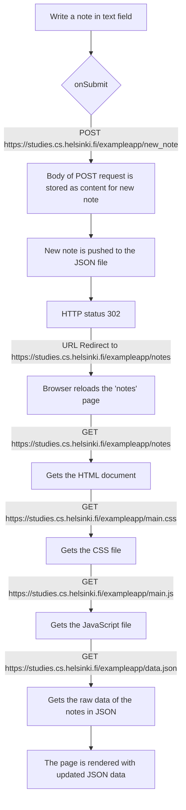

```mermaid
flowchart
    A[Write a note in text field]
    A --> B{onSubmit}
    B -->|POST https://studies.cs.helsinki.fi/exampleapp/new_note| W[Body of POST request is stored as content for new note]
    W --> P[New note is pushed to the JSON file]
    P --> C[HTTP status 302]
    C -->|URL Redirect to https://studies.cs.helsinki.fi/exampleapp/notes| D[Browser reloads the 'notes' page]
    D -->|GET https://studies.cs.helsinki.fi/exampleapp/notes| E[Gets the HTML document]
    E -->|GET https://studies.cs.helsinki.fi/exampleapp/main.css| F[Gets the CSS file]
    F -->|GET https://studies.cs.helsinki.fi/exampleapp/main.js| G[Gets the JavaScript file]
    G -->|GET https://studies.cs.helsinki.fi/exampleapp/data.json| H[Gets the raw data of the notes in JSON]
    H --> I[The page is rendered with updated JSON data]
```
