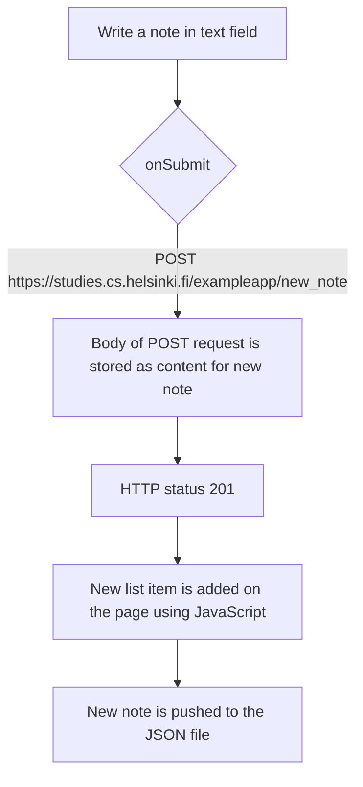

```mermaid
flowchart
    A[Write a note in text field]
    A --> B{onSubmit}
    B -->|POST https://studies.cs.helsinki.fi/exampleapp/new_note| P[Body of POST request is stored as content for new note]
    P --> C[HTTP status 201]
    C --> D[New list item is added on the page using JavaScript]
    D --> E[New note is pushed to the JSON file]
```
